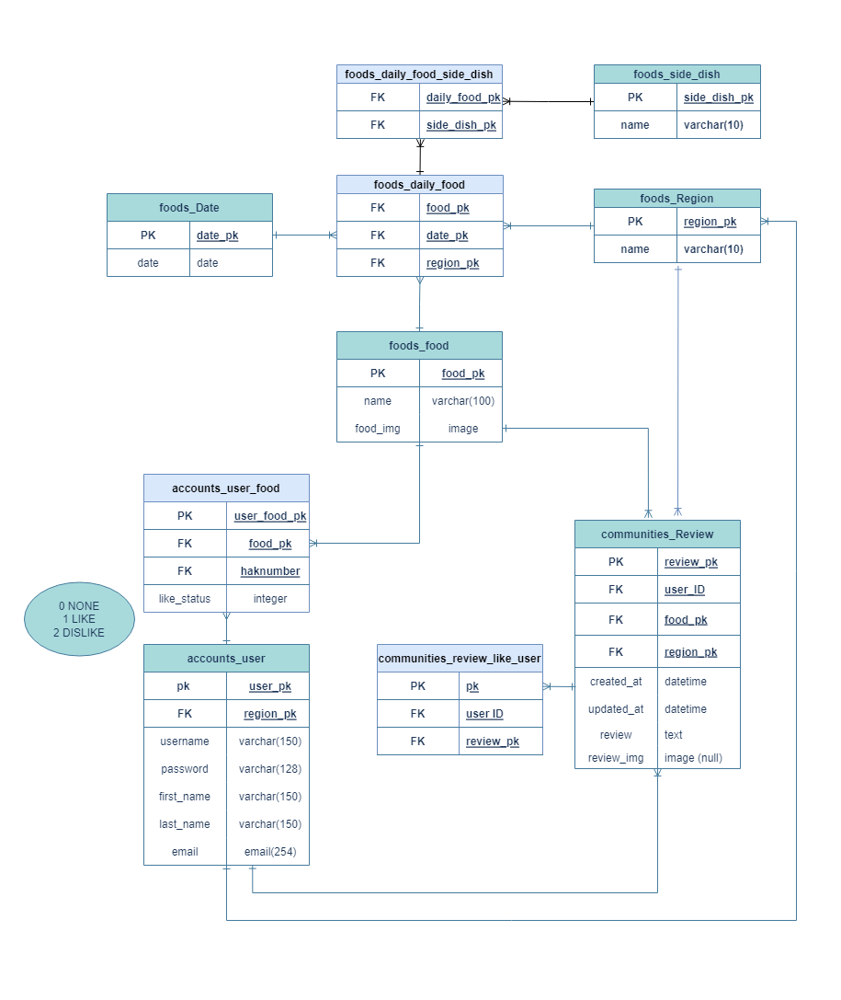

# SSAHAKSIK README

# 🥢 PROJECT ‘SSAHAKSIK’

---

삼성 청년 SW 아카데미(이하 싸피)의 각 캠퍼스에서 제공하는 식단을 **<SSAFY+학식(캠퍼스 식단)>**을 **싸학식**이라 칭하였습니다.

 일상 회복 단계로 전환되면서 대면 생활이 시작되고 지역별 캠퍼스에서 식사를 하게 되면서 이에 대한 정보를 보여주고, 서로 공유하는 서비스를 제공하면 좋겠다고 생각하여 싸학식 프로젝트를 시작하게 되었습니다.

# 📅 프로젝트 기간

---

### 💡 **아이디어 회의 및 구상**

6월 1일(수) ~ 6월 13일(월)

### 🎨 **개발 및 디자인 작업**

6월 1일(수) ~ 7월 6일(수)

### 🛐 프로젝트 배포

7월 7일 (목) 서비스 시작

[http://ssahaksik.shop](http://ssahaksik.shop)

# 👥 팀 구성

---

## 🖥️ Front-end

### 👨🏻‍💻 **김신철**

**React**

**CSS**

**웹 디자인**

### 👨🏻‍💻 **박종민**

**React**

**CSS**

### 👨🏻‍💻 **임상빈**

**CSS**

**웹 디자인**

### 👑 **한지운**

**React**

**CSS**

## 🌐 Back-end

### 👩🏻‍💻 **이영주**

**Django**

### **👩🏻‍💻 최희선**

**Django**

## 🏗️ 공통 작업

**기획/아이데이션**

**Figma 제작**

**ERD 작성**

# 📝 데이터 모델링 (ERD)

---

# 🛎️ 서비스 소개 및 구현

---

## 👀 인터페이스 한 눈에 보기

### 🍱 싸학식 페이지

### 🏕️ 싸밖식 페이지

### 💻 반응형 페이지 구현

태블릿, 모바일 환경에서도 간편하게 서비스를 누릴 수 있도록 반응형 페이지를 구현했습니다.

## 🔍 상세 기능 설명

### 로그인과 회원가입

싸학식 로고 옆에 위치한 메뉴 서랍 버튼을 누르면, 회원가입과 로그인 버튼이 존재합니다.

로그인을 하지 않아도 메뉴를 확인하고 싸밖식을 확인할 수 있지만, 좋아요와 싫어요를 눌러 메뉴 평가에 참여하거나 리뷰를 작성하기 위해서는 로그인이 필요합니다.

로그인이 되면 가입 정보와 회원정보 수정이 보입니다.

로그인 시 사용할 아이디와 이름, 비밀번호 재설정을 위한 이메일, 비밀번호, 소속 캠퍼스를 선택하여 회원가입을 진행합니다.

### 회원정보 수정과 삭제

로그인 후 서랍 내 하단에 위치한 회원정보 수정을 선택하면 소속 캠퍼스를 변경할 수 있습니다. 

캠퍼스 정보를 수정한 후 확인 버튼을 누르면 수정이 완료되었다는 알림이 상단에 띄워집니다. 이후 메인으로 이동을 눌러 싸학식의 본 페이지로 이동합니다. 캠퍼스 정보 수정 후 변경된 캠퍼스의 식단 정보가 메인 화면에 보여집니다.

회원정보 수정 페이지 하단에는 비밀번호 변경과 회원탈퇴 버튼이 위치해 있습니다.

회원탈퇴를 누르면 다시 한 번 탈퇴여부를 묻는 알림창이 뜨며, 확인 또는 취소로 탈퇴를 결정할 수 있습니다.

비밀번호 변경 버튼을 통해 기존 비밀번호를 새 비밀번호로 변경할 수 있습니다.

비밀번호 변경 페이지에서 빈 칸으로 제출을 하게 되면 폼을 입력하라는 알림이 발생합니다.

비밀번호 변경과 비밀번호 재설정은 다른 방식으로 작동합니다.

비밀번호 변경은 기존 로그인 상태에서 비밀번호를 변경하는 것을 의미한다면, 비밀번호 재설정은 아이디는 아는데 비밀번호를 모르는 경우에 사용합니다.

가입했던 이메일을 입력하여 비밀번호 재설정 메일을 통해 비밀번호를 변경하실 수 있습니다.

로그인을 하지 않고 비밀번호를 재설정하는 경우에는 가입 당시 입력했던 이메일을 작성하면 비밀번호 재설정 메일이 발송되며 메일에 발송된 링크를 통해 비밀번호 재설정이 가능합니다.

### 캠퍼스 별 식단 제공

본인의 캠퍼스 외에 다른 캠퍼스의 식단을 확인할 수 있으며, 식당에서 여러가지 식단을 제공할 시, 화면 좌우에 화살표 버튼이 생성되며 해당 버튼으로 동일 날짜의 다른 식단을 보실 수 있습니다.

모든 캠퍼스의 식단을 최대한 제공하려 노력하고 있으나, 식단 정보를 제공 받지 못하는 경우 또는 식단이 나오지 않는 주말인 경우 상태를 알리는 이미지가 띄워지게 됩니다.

평가나 리뷰 작성 또한 해당 상태가 되는 경우에는 작업이 불가능합니다.

### 식단 평가와 리뷰 작성

로그인 상태에서는 리뷰를 작성할 수 있습니다. 로그인을 하지 않았을 경우 작성할 수 없다는 에러 알림이 뜨지만, 로그인 시 알림이 사라지고 게시 버튼을 누르면 정상적으로 식단에 대한 리뷰 작성이 가능해집니다.

식단은 평가를 할 수 있습니다. 각 음식 이미지 하단에 좋아요와 싫어요 버튼이 존재하며 버튼을 클릭할 때마다 이미지 위에 학생들이 평가한 좋아요와 싫어요의 비율에 맞게 각기 다른 문구가 등장하게 됩니다.

평가는 기록되어 사용자가 날짜를 바꾸어서 다시 돌아와도 평가에 대한 기록은 유지됩니다.

## 💬 개발자 인터뷰

---

## Q. 먼저 프로젝트를 끝낸 소감 한마디씩 해주세요.

### 🧑🏻‍🦳 **최희선**

🎙️ 드디어 끝났다!!!!! 좋은 사람들과 하고 싶었던 것을 해서 재밌게 마무리할 수 있었던 거 같습니다

### 🧑🏼 **이영주**

🎙️ 다들 너무너무 고생하셨습니다! 진짜 열정과 근성이면 못 해낼 게 없구나, 감탄하게 되는 프로젝트였습니다. 좋은 팀원들을 만나서 많이 배워갑니다. 

### 🧑 **임상빈**

🎙️ 여기 버스 달달합니다. 환승 없이 직행으로 갈 수 있어서 너무 좋았어요! 다들 정말 소통상, 리액션상, 긍정상       드리고 싶습니다 😊 정말 개발하는 과정에서 많은 부분 노력이 필요하다는 것 공부도 필요하다는 것 느꼈고, 열심히 하고자 하는 의지가 중요하다고 느껴졌습니다. 뒤로 갈수록 저는 많이 해이해지고 그랬는데, 다른 팀원들의 열정과 의지로 진짜 버틸 수 있었던 것 같습니다. 다들 행복하세요 얼른 회식해요~

### 🧚🏻‍♂️ **김신철**

🎙️ 실제 배포를 염두에 두고 프로젝트를 진행한 것은 처음이어서 해낼 수 있을까 걱정했는데, 결국 해내서 기쁩니다. 이제 자고 싶습니다.

### 👦🏻 **박종민**

🎙️ 제가 부족했던 부분을 다른 팀원들이 많이 케어해주셔서 잘 끝난 것 같습니다. 이번 프로젝트로 팀원 분들께 다방면으로 많은 것을 배워갑니다.

### 🧑🏻 **한지운**

🎙️ 부족한 팀장이었는데 팀원들이 잘 따라와줘서 너무 감사하다는 말하고 싶습니다!  개인적으로는 구현보다 배포에서 더 힘들었습니다. 개발하는 법 말고도 팀원들과 소통하는 법, 계획의 중요성 등등 정말 많은 걸 느낄 수 있는 프로젝트였습니다!

## Q. 프로젝트를 하면서 기술적으로 가장 어려웠던 점은 무엇인가요? 어려움을 어떤 식으로 해결하셨나요?

### 🧚🏻‍♂️ **김신철**

🎙️리액트를 처음 배워가면서 프로젝트를 동시에 진행하다보니 중간중간 코드를 수정해야할 부분들이 생겨서 쉽지 않았습니다. 간단한 문제인데도 리액트를 제대로 알고 프로젝트를 시작한 것이 아니다보니 돌아갔던 적도 많았습니다. 빠른 시간 내에 구현을 해야하다보니 막힐 때는 비슷하게 구현을 한 다른 코드들을 많이 참고하면서 공부했습니다.

### 🧑🏻‍🦳 **최희선**

🎙️ 배포. 저희가 생각한 것보다 훨씬 오랜 시간이 걸려서 가장 큰 변수였던거 같습니다. 배포 강의를 다시 보면서 차근차근 다시 진행하고, 막히는 부분은 구글링하고, 문제 되는 코드를 다시 수정하면서 무한 삽질과 반복의 연속으로 해결했습니다.

### 🧑🏼 **이영주**

🎙️ 프론트를 진행하신 팀원분들이 너무너무 대단하신 것 같습니다. 다들 리액트에 처음으로 도전해보시는 거였는데 정말 멋지게 해내셨어요. ♡⁺◟(●˙▾˙●)◞⁺♡  (물론 그 뒤에는 눈물의 구글링과 동영상 강의, 공식문서의 무덤이 있었습니다….)

### 👦🏻 **박종민**

🎙️ 개발 초기에 리액트, 리덕스, 라우터 관련된 개념을 충분히 숙지했다 생각하고 개발에 참여했지만 실질적으로 사용하는데 어려움이 있어 정말 필수적인 개념 외에는 사용을 거의 안했습니다. 이를 통해 아무리 강의를 듣고 열심히 문서를 보더라도 실전에서 코딩으로 쓰이는 것이 경험에 큰 도움이 된다는 깨달음을 얻게 되었습니다.

UseEffect를 통해 생명주기 함수를 구현하는데 있어 무한 렌더링이 되는 에러를 자주 겪었습니다. 여러 번 에러를 경험하며 에러를 찾아보고 해결할 수 있는 능력을 키울 수 있는 계기가 되었던 것 같습니다.

코드가 길어지고 css도 MUI Component와 섞이며 코드를 보고 해석하는데 시간이 오래 걸렸습니다. 중반부터는 최대한 깔끔하게 코드를 짜려고 노력했지만 이번 프로젝트를 겪으며 코딩을 깔끔하게 하는 일이 프로젝트의 중요한 한 부분이라는 생각이 들었습니다.

### 🧑🏻 **한지운**

🎙️ 1달도 안되는 시간 안에 리액트를 배워서 쓰는 게 가장 어려웠습니다. 그 중에서도 메인 페이지에서 사용자 로그인 상태에 따라 다른 화면을 보여주는 것이 제일 까다로웠습니다. 비로그인 상태일 때는 서울캠퍼스를 기본값으로하고, 로그인 상태일 때는 회원정보에 기반한 캠퍼스를 기본값으로 보여주고 싶었습니다. 중앙 상태 저장소로 리덕스를 사용하였는데, 여기서 디폴트값과 회원정보를 가져오는데 시간 차이가 있있습니다. 그래서 먼저 기본값인 서울 캠퍼스에 대한 정보를 제공하고, 회원정보를 가져오면 그에 맞은 캠퍼스 식단 정보를 제공하도록 구현했습니다.

### 🧑 **임상빈**

🎙️ 프론트엔드를 하면서 생각하는대로 구현이 되지 않아서 어려웠습니다. CSS나 버튼 동작, axios등… 검색을 통해 가져온 코드를 수정하는 과정에서 구조를 잘 이해하지 못한 상태로 작성하다보니 오류가 발생하거나 동작이 안되는 경우가 있었습니다. 이럴 때 잘 알고 있는 팀원의 도움을 받아 다같이 코드를 완성할 수 있었습니다. 그 과정에서 혼자 고민하는 것보다는 어려울 땐 빠르게 도움을 청해서 해결하고 그 외에 제가 능력을 발휘해서 도울 수 있는 곳에서 능력을 활용해 해야할 업무 중 할 수 있는 일들을 하면 된다는 것을 배웠습니다.

## Q. 프로젝트를 진행하면서 아쉬웠던 점이 있다면, 어떤 것인가요?

### 🧑🏻 **한지운**

🎙️ 코드를 가독성있게 짜지 못한 것이 가장 아쉽습니다. 리액트를 완전히 이해하지 못한 상태에서 프로젝트에 바로 쓰다보니, 컴포넌트화할 수 있는 것들을 하지 못했다는 아쉬움이 있습니다. 다음 프로젝트에서는 더 세부적으로 계획을 짜서, 재사용성과 가독성에 중점을 둔 코드를 작성하고 싶습니다. 그리고 다음에는 CSS에 더 참여하고 싶습니다.  

### 🧑🏼 **이영주**

🎙️ 중반부터 프로젝트에 제대로 참여하지 못해서(ㅠㅠ) 리액트나 배포 과정을 제대로 참여하지 못한 점이 가장 아쉽습니다. 기술적인 부분 외로도 열정 가득하신 팀원분들께서 프로젝트 진행하시는 모습을 보면서 많이 배울 수 있었습니다.

사실 지운님의 입맛 찾기가 싸학식의 시작이었는데, 팀장님 입맛을 찾으시는 데에 도움이 됐는지 궁금합니다(쓰고 보니 기능이 아니네요!). 다들 고생 많으셨습니다.  (*ˊᵕˋo💐o

### 🧑🏻‍🦳 **최희선**

🎙️ 프로젝트 거의 끝날 무렵 HTTP에 대해서 공부를 했고, back api를 설계할 때 고려하지 못한 부분이 많다는 것을 깨달았습니다. 예를 들어 최대한 리소스만 남기고 method를 다르게 하는 식으로 api를 만들어야 하는데 동사 형태에 url를 포함하는 식으로 작성했습니다. 이 부분이 프로젝트 끝나고 배워서 아쉽게 느껴집니다. 또한 back에서 500에러가 나올 수 있는 경우를 최대한 생각하고 막아야 하는데 그 부분에 대해 많이 캐치하지 못 해서 아쉬웠습니다. (항상 500 에러나면 알려주신 팀원들에게 감사합니다.

영주님이랑 끝까지 못해서 정말 아쉬웠습니다.. 개발하는 것도 의미 있지만 팀원이랑 같이 프로젝트 하는 것이 정말 즐거운 거 같습니다.

React를 거의 참여하지 못해서 아쉬웠습니다. 프론트에 도움을 드리고 싶었지만 많은 도움을 드리지 못했고, 개인적으로 React를 더 공부해봐야겠다는 생각을 하게 되었습니다. 그래도 저희 React 사용하길 잘한거 같습니다!

### 🧚🏻‍♂️ **김신철**

🎙️ 변수명이나 속성값을 줄 때 제대로 통일이 되지 않아서 서로 코드를 알아보기 쉽지 않았던 점이 있었습니다. 또한 처음부터 Component를 제대로 쪼개지 않고 차츰 수정해나가다보니 완벽하게 리액트스러운 코드 구성이 아닌 부분도 있는 것 같아 아쉽습니다. 그리고 처음 기획과 달리 제대로 구현이 되지 않거나, UX적으로 문제가 있는 것들을 발견하여 수정하게 되는 부분이 생겨서 아쉽습니다. 

### 👦🏻 **박종민**

🎙️ 리팩토링이 제대로 안되어 코드가 보기 어렵고 hook 함수를 다양하게 사용하여 좀 더 간편하게 코드를 짤 수 있었지만 그렇게 하지 못한 점이 아쉬웠습니다. 또, 처음에 DB에 Data를 모바일 크롤링을 통해 받으려고 시도하였지만 실패하여 휴먼 인풋으로 직접 Data를 넣는 방식으로 프로젝트를 진행했습니다. 다음 기회에는 꼭 모바일 크롤링을 성공하고 싶은 마음이 듭니다.

### 🧑 **임상빈**

🎙️ 프로젝트를 통해 부족한 점을 보완하고자 하였는데, 리액트를 배우면서 새로운 지식이 늘어나고 부족한 점에 대한 인식이 사라지게 된 것 같아서 아쉬웠습니다. 그래도 프론트엔드 언어를 하나 알아가면서 어떻게 코드가 동작되는지 이해할 수 있어서 다른 언어를 활용할 때 도움이 되겠다고 생각이 들었습니다. 또 코드를 어떻게 수정해야할 지 몰라 다른 방향으로 구현한 기능을 보면서 리액트나 공식문서를 통해 지식을 쌓고 많이 적용해볼 수 있도록 해야겠다고 생각했습니다.

### Q. 프로젝트 중에서 추가로 구현하고 싶은 기능이 있다면, 어떤 것인가요?

### 👦🏻 **박종민**

🎙️ 데이터를 DB에 사람이 직접 기입하지 않고 모바일 크롤링을 통해 데이터를 받는 코드를 구현해보고 싶습니다.

### 🧑🏻‍🦳 **최희선**

🎙️ 종민님 말씀처럼 모바일 크롤링을 성공했으면 정말 좋았을 거 같습니다. 또한 DB를 분리해서 관리하는 형태도 해보고 싶습니다.

### 🧑🏻 **한지운**

🎙️ 북마크 기능과 소셜 로그인 기능을 구현하지 못한 것이 아쉽습니다. 사용자가 북마크한 식단이 다시 나오면 알려주는 기능을 구현하고 싶었는데, 시간 관계상 구현하지 못했습니다. 유지 보수하면서 시간이 난다면 추가하고 싶습니다. 로그인 기능도 우선순위에 밀려 소셜 로그인까지 하지 못했는데, 다음 프로젝트에서는 꼭 소셜 로그인 구현하고 싶습니다. 

### 🧚🏻‍♂️ **김신철**

🎙️ 싸밖식 기능을 제대로 구현해보고 싶어요. 싸학식에 생각보다 많은 힘을 주다보니 지금은 근처 식당과 카카오맵을 보여주는 기능 정도만 구현이 되어있어서 아쉬움이 남네요. 싸밖식에 학생들이 직접 식당 랭킹을 부여한다든지, 필터를 통해 음식점을 고를 수 있다든지 하는 기능이 있다면 좋을 것 같아요.

### 🧑 **임상빈**

🎙️ 싸밖식에서도 핀을 눌렀을 때 리뷰를 작성할 수 있는 창이 뜨거나 정보가 뜰 수 있도록 구현해보고 싶습니다.

### Q. 프로젝트를 하면서 배운 점이 있다면, 어떤 것인가요?

### 🧑🏻‍🦳 **최희선**

🎙️ 싸피 1학기 최종 프로젝트를 하면서 우선순위를 정하는 것이 중요하다는 점과 UI/UX를 고려하는 것의 중요성에 대해 배웠습니다. 팀원들과 아이디어를 주고 받는 과정에서 힘 줄 부분에 대해서 정하고, 목업을 작성하는 과정에서 사용자의 편의를 생각하는 방법에 대해 많이 배울 수 있었습니다. 특히 신철님이 사용자 입장에서 많이 고려하고 의견을 내줘서 많은 배움을 얻을 수 있었습니다.

그리고 일단 git 사용하는 방법에 대해서 배울 수 있었습니다. 1학기 최종 프로젝트를 하는 과정에서도 git을 사용했지만 여러 명에서 git을 사용하다보니 여러 에러를 봤고… 학습할 수 있었습니다.

백엔드와 프론트엔드를 나눠서 진행한 첫 프로젝트이다 보니 백과 프론트의 소통이 중요하고 소통하는 방식에 대해 배울 수 있었던거 같습니다. 프론트에서 요청했을 때 그거에 맞게 수정하고, 프론트에서 어떤 식으로 코드를 짤지 예상하고 백코드를 짜고 의견을 나눴습니다. 또한 이 부분을 백에서 처리하는게 효율적일지 프론트에서 처리하는게 효율적일지 많은 고민을 거쳤던거 같습니다.

마지막으로 저희 팀원들 한명 한명 다 능력자여서 많이 배울 수 있었습니다. 긴 기간이었지만 지치지 않고 으샤으샤하게 해서 즐겁게 프로젝트 마무리 할 수 있었습니다!!

### 🧑🏻 **한지운**

🎙️ 서비스 개발에서 기능 구현뿐만 아니라 에러의 중요성에 대해서 알게 되었습니다. 예를 들어 비밀번호 변경 페이지에서 3가지 오류가 발생할 수 있습니다. 현재 비밀번호를 잘못 입력한 경우, 새로운 비밀번호가 기준에 적합하지 않은 경우, 새로운 비밀번호 확인에서 일치하지 않은 경우가 있습니다. 이 모든 경우 내부적으로 발생하는 에러를 사용자에게 단순히 ‘다시 입력해주세요’리고 처리할 수도 있습니다. 그러나 상세하게 어떤 입력값이 잘못되었는지 구분하여 표시해주면, 사용자 경험이 향상될 것이라고 생각했습니다. 각 오류별로 에러 문구를 다르게 해서 사용자가 쉽게 어떠한 부분이 잘못됐는지 알 수 있게 하였습니다. 

### 🧚🏻‍♂️ **김신철**

🎙️ 협업에 대해 다시 한번 생각해보게 되었습니다. 여섯 명이 동시에 코드를 수정하다 보니 논의하고 공유되어야 할 부분이 생각보다 많았고, 세세한 부분까지 서로 커뮤니케이션이 잘 되지 않으면 오류가 나서 어려움이 많았습니다. 소통 방식과 협업 방식을 어떻게 하면 더 효율적으로 바꿀 수 있을지 고민을 많이 했던 시간이었습니다. 또한 시간 분배에 대해서도 많이 배웠습니다. 초반에 시간 배분을 잘못해서 싸학식에 노력을 과하게 붓지 않았나 하는 생각이 듭니다. 그래서 싸밖식에 많은 기능을 넣지 못해서 아쉬움이 남습니다.

### 👦🏻 **박종민**

🎙️ 프로젝트 과정 중에서 기획이 가장 중요하다는 것을 다시 한번 깨닫게 되었습니다. 기획 단계에서는 앞으로 해야 할 플랜을 잘 구성했다고 생각했지만 실제로 코딩을 하며 그 자리에서 의견을 수렴하여 코드에 반영하는 방식이 많았습니다. “아는 만큼 보인다” 라는 말이 이런 곳에 해당된다는 것을 느꼈고 같은 분야의 팀원은 물론 다른 분야(백엔드) 팀원과의 협업도 중요하다는 것을 알았습니다. API를 통해 정보를 프론트엔드에서 요청을 보낼 때 백엔드 팀원과 상의를 하며 코딩 능률이 올라가는 것을 볼 수 있었고 혼자 할 때 보다 재밌고 좋은 경험이 되었던 것 같습니다.

### 🧑 **임상빈**

🎙️ 기존의 2인이서 하던 개발에서 6인으로 늘어나면서 많은 사람들과 협력하고 협업하는 방법과 협업 툴 사용법을 배울 수 있었습니다. 정말 중요한 소통! 필요한 것이 있거나 문제가 생기면 바로바로 말해서 해결할 수 있도록 해야 한다는 점, 그리고 서로 어느 위치에서 어떠한 작업을 진행하고 있는지 소통하여 코드에 충돌이 발생하지 않도록 해야 한다는 점, 서로 일정이 맞지 않아 각자 코딩을 하는 경우에 진행 상황을 기록하고 그 사항을 알려야 한다는 점 등.. 협업과 협력의 과정을 실무처럼 이용해볼 수 있어서 좋았습니다. (Git, Jira, Figma, VSC Live Share, Notion 등)

꾸준히 좋은 점들을 다른 프로젝트에서도 적용할 수 있도록 할 것이며 이 과정을 함께 해준 팀원들이 너무나 고맙습니다.